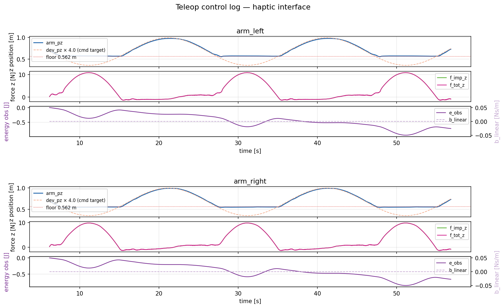
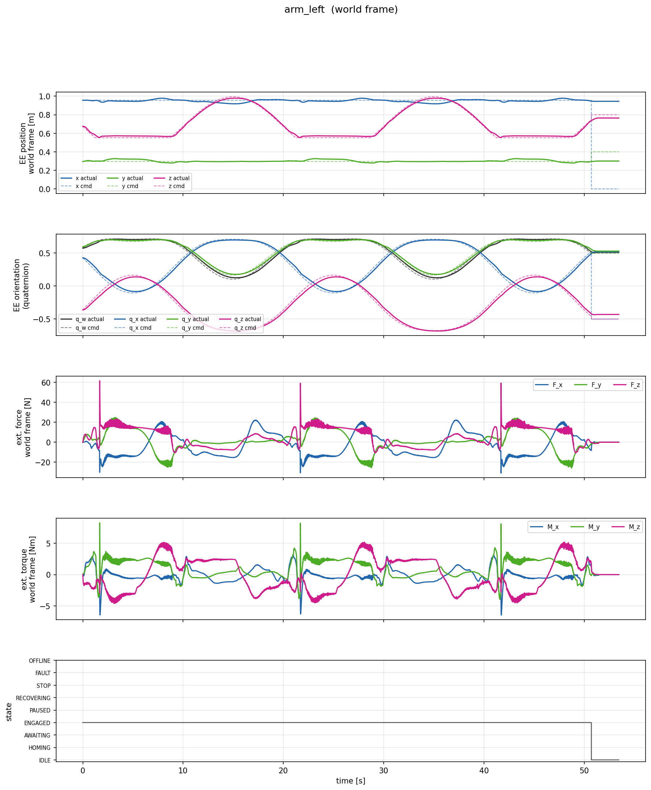
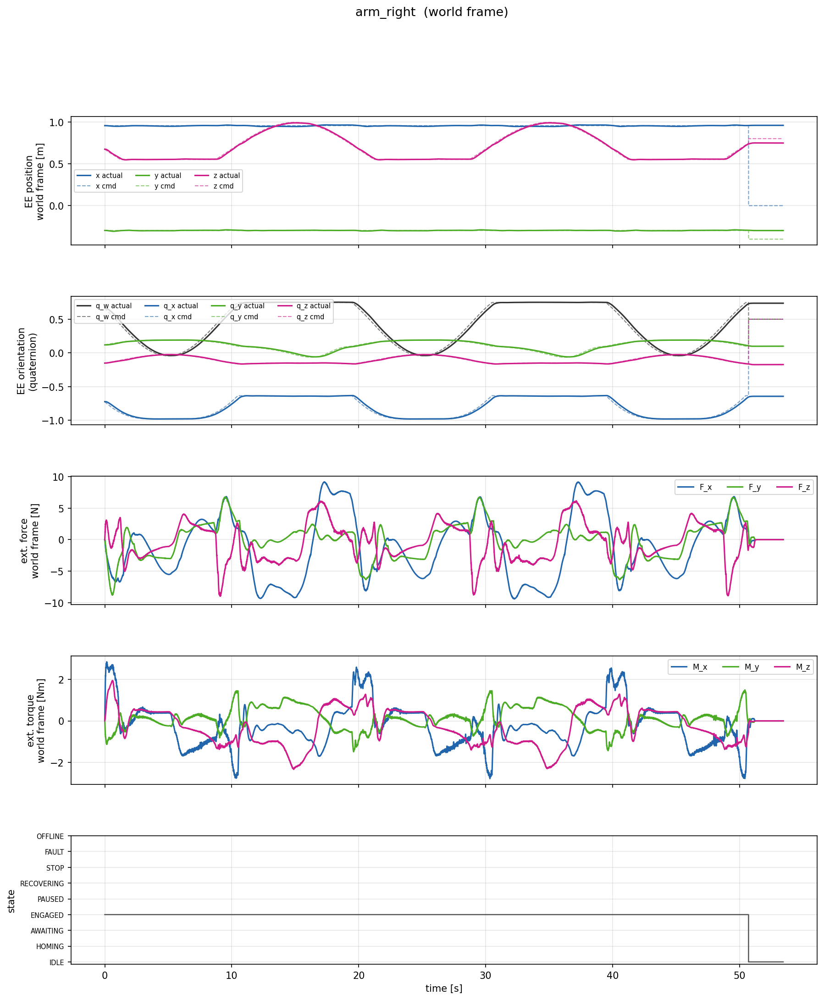

# teleop-haptic-interface

Operator-side haptic teleoperation interface. Two Sigma 7 devices map to two Franka Panda arms running in a MuJoCo sim (avatar side).

Avatar / simulation repo: [teleop-avatar](https://github.com/AlexanderWegenerRobotics/teleop-avatar.git)

---

## What it does

The operator holds two Sigma 7 haptic devices. The interface sends position/orientation deltas to the corresponding robot arms and renders force feedback based on how far the arm deviates from where the device commanded it to be. A passivity observer monitors the net energy flowing to the operator and injects damping if the loop starts adding energy (relevant under network latency).

---

## Folder structure

```
config/
  system.yaml          # ports, log dir, mock_motion flag
  haptic_left.yaml     # device id, frame rotation, impedance gains, safety limits
  haptic_right.yaml

include/
  haptic_device.hpp    # IHapticDevice interface
  mock_haptic_device.hpp   # sine-wave mock, no hardware needed
  sigma_device.hpp     # Sigma 7 wrapper (only compiled WITH_SIGMA=ON)
  teleop_controller.hpp
  teleop_session.hpp
  passivity_controller.hpp
  avatar_channel.hpp
  arm_channel.hpp
  udp_arm_channel.hpp
  network/             # UDP primitives (stream + reliable)

src/
  main.cpp
  teleop_session.cpp   # top-level state machine (IDLE / ENGAGED)
  teleop_controller.cpp  # 1 kHz control loop per arm
  passivity_controller.cpp
  udp_arm_channel.cpp
  avatar_channel.cpp
  sigma_device.cpp
  network/
```

---

## How a control step works

1. **Read device** — get position, orientation, velocity from Sigma 7 (or mock)
2. **Compute setpoint** — take the delta from the captured origin pose, rotate into world frame, apply motion scaling → send as `ArmCommandMsg` to the arm over UDP
3. **Compute haptic wrench**
   - position error: `(arm displacement from its origin) − (device displacement from its origin × scale)`
   - orientation error: quaternion difference between commanded and actual arm orientation
   - impedance: `F = K·error − D·velocity`
   - passivity correction: if `E_obs = ∫ F·v dt > 0` (net energy delivered to operator), inject variable damping to drain the surplus
   - rate-limit and magnitude-clamp for safety
4. **Send force** — output to Sigma 7 (or no-op for mock/null)
5. **Log** — device pose, arm pose, impedance force, passivity correction, energy observation → CSV

The origin is captured on SPACE press. Both arms snapshot their own pose and the device pose at that moment; all subsequent errors are relative to that snapshot so there's no jump on engage.

---

## Frame convention

Sigma 7 axes don't match world axes. `frame_rotation` in the haptic YAML defines `R_device_to_world`. Currently:

```
R = diag(-1, -1, 1)   # sigma X=backward → world X=forward, Y=right → Y=left
```

Tune this once real hardware is connected and the arm moves in the wrong direction.

---

## Building

Dependencies via vcpkg: `Eigen3`, `Poco`, `yaml-cpp`, `msgpack-cxx`

```bash
cmake -B build -DWITH_SIGMA=OFF
cmake --build build --config Release
```

`WITH_SIGMA=OFF` (default) compiles without the Sigma SDK — uses `MockHapticDevice` or `NullHapticDevice` depending on the `mock_motion` flag in `system.yaml`.

---

## Running

```bash
./build/Release/teleop_haptic_interface.exe config/system.yaml
```

- **SPACE** — capture origin and engage
- **ESC / q** — disengage
- **Ctrl-C** — quit

Logs land in `log/` as CSV, one file per arm.

For real hardware: rebuild with `-DWITH_SIGMA=ON` and set `mock_motion: false` in `system.yaml`. Tune `frame_rotation` in `haptic_left.yaml` / `haptic_right.yaml` if the arm moves in the wrong direction on first engage.

---

## Testing without hardware

Set `session.mock_motion: true` and `mock_profile: contact_z` in `system.yaml`. The `contact_z` profile drives both arms through ±320 mm sinusoidal motion on the world Z axis (toward the table) at 0.05 Hz, simultaneously sweeping ±90° of pitch — a simulated downward grasp approach.

Available profiles:

| `mock_profile` | Motion |
|---|---|
| `free_x` | ±80 mm sine on X — baseline passivity test |
| `contact_z` | ±320 mm on Z + ±90° pitch sweep — table contact test |
| `contact_z_down` | ±320 mm on Z + fixed −90° pitch — EE-down approach test |

After running, generate plots with:

```bash
# sigma-side only
python tests/plot_control.py log

# sigma + avatar side (pass the episode folder from the avatar's log output)
python tests/plot_control.py log logs/000
```

PNGs are saved to `docs/`.

---

## Validation results

All plots are from a `contact_z` run: ±320 mm Z-sweep at 0.05 Hz with simultaneous ±90° pitch sweep, mock motion, no real hardware.

### Haptic interface — sigma side

Row 1: EE z position tracking vs commanded target, safety floor at 0.562 m.
Row 2: Impedance force and total haptic wrench rendered to the operator.
Row 3: Passivity energy observation and injected damping. `e_obs < 0` and `b_linear = 0` confirms the loop is passive under simulated contact motion.



### Robot response — avatar side

Per-arm plots in world frame. Rows: EE position xyz (actual vs cmd), EE orientation quaternion (actual vs cmd), estimated external force `O_F_ext_hat_K` [N], estimated external torque [Nm], controller state.

Position and orientation tracking are tight on both arms. External forces on the left arm peak at ~60 N on the z-component at the lowest point of each cycle — this is the table-contact signal and the primary candidate for adding contact feedback to the haptic wrench.




